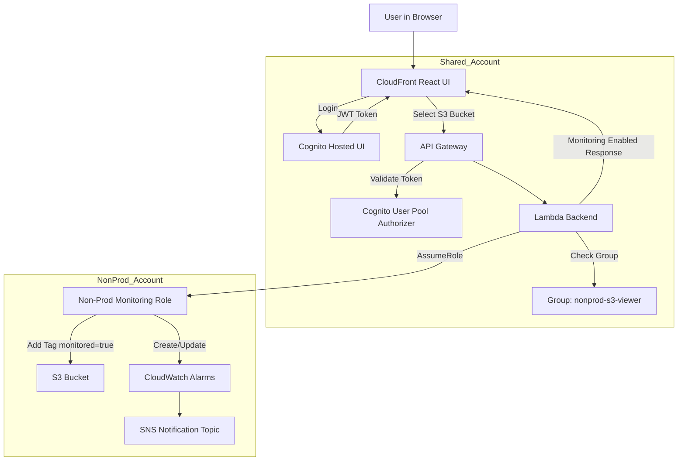

# AWS Self Service Monitoring Platform

A multi-account AWS platform designed to demonstrate secure cloud operations, centralized authentication, cross-account access, Infrastructure as Code, and production-style AWS architecture patterns.

The platform provides a centralized operational layer where authenticated users can securely access AWS workload environments without direct account access or long-term credentials.

## Architecture Overview

The architecture uses three AWS accounts.

## Architecture Diagram



### 1. CICD Account

Purpose:
Centralized deployment and infrastructure automation.

Services:
- AWS CodeCommit
- AWS CodePipeline
- AWS CodeBuild
- CDK deployment orchestration

### 2. Shared Account

Purpose:
Centralized platform and authentication layer.

Services:
- CloudFront
- React UI
- Amazon Cognito
- API Gateway
- AWS Lambda

### 3. Non-Prod Account

Purpose:
Target workload environment.

Services:
- Amazon S3
- IAM Roles

## Architecture Flow

```text
User
↓
CloudFront React UI
↓
Cognito Hosted UI
↓
API Gateway
↓
Lambda Backend
↓
Cross-account IAM Role
↓
Non-Prod AWS Resources
```

## Key Design Decisions

- Multi-account AWS architecture
- Centralized authentication using Cognito
- Cross-account IAM role assumption
- No AWS credentials exposed to frontend
- Infrastructure as Code using AWS CDK
- Dedicated CI/CD account
- Least-privilege deployment access
- Serverless backend architecture

## Repository Structure

```text
AWS-SELF-SERVICE-SYSTEM/
│
├── config/
│   └── var.config.json
│
├── frontend/
│   └── build/
│       └── index.html
│
├── lambda/
│   └── get_resources/
│       └── index.py
│
├── stacks/
│   ├── cicd_pipeline_stack.py
│   ├── shared_platform_stack.py
│   └── nonprod_monitoring_role_stack.py
│
├── stages/
│   └── platform_stage.py
│
├── app.py
├── cdk.json
├── requirements.txt
└── README.md
```

## AWS Services Used

- AWS CDK
- CloudFront
- Amazon Cognito
- API Gateway
- AWS Lambda
- IAM
- STS AssumeRole
- CodePipeline
- CodeBuild
- CodeCommit
- Amazon S3

## Future Enhancements

- Step Functions orchestration
- CloudWatch alarm automation
- Tag-driven monitoring
- DynamoDB fine-grained authorization
- Compliance automation
- Operational workflows

## Disclaimer

This project was created for cloud architecture learning and AWS Solutions Architect practice.
